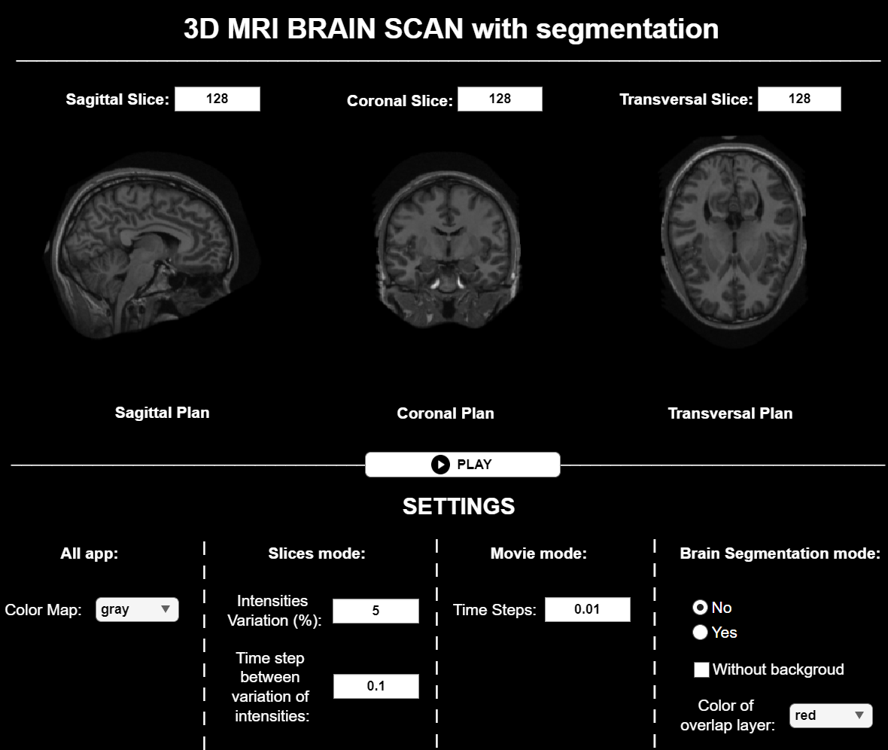

# **Brain Segmentation**

## Overview
This project focuses on the segmentation of brain images in both continuous time and isolated image modes. The segmentation process is performed across three anatomical planes: Coronal; Sagittal; Axial. The accompanying graphical user interface (GUI), GUI_API_FinalProject.mlapp, allows users to visualize and interact with the results of the segmentation process.



## Purpose
The main objective of this project is to enable efficient brain segmentation using image analysis and processing techniques. The GUI offers several visualization modes and segmentation options, making it a comprehensive tool for analyzing brain slices.

## Features
1. _Slice Mode_
  - Allows users to select and view specific slices of the brain.
  - Displays slices sequentially based on pixel intensity levels.

2. _Movie Mode_
- Presents brain slices dynamically in a slideshow format.
- Automatically returns to the central slices upon completion.

3. _Brain Segmentation Mode_
- Offers brain delineation with or without the background.
- Can be combined with Movie Mode for dynamic segmentation visualization.

**Note: Some limitations in dynamic mode may appear for certain slices due to algorithmic constraints.**

## How to Use
1. _Run the Program_

To launch the application, simply execute the following command in MATLAB:
```matlab
   run GUI_API_FinalProject.mlapp
```

2. _App Interface_

Slice Mode: Use the numeric input boxes at the top to select a specific slice for viewing.
Movie Mode: Enable dynamic visualization of brain slices.
Brain Segmentation Mode: Toggle this option to apply segmentation to the selected slice or during the Movie Mode.

## Requirements
MATLAB (with support for .mlapp files)

Image Processing Toolbox (recommended)

## Notes
The segmentation algorithm is optimized for single slices but may have some limitations in dynamic Movie Mode for certain slices.

**Feedback and suggestions for improvement are welcome :)**
